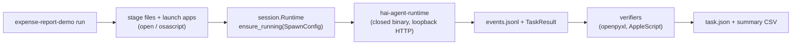

# Expense Report

A deterministically verified multi-app demo for [holo-desktop-cli](https://github.com/hcompai/holo-desktop-cli): Holo reads a folder of receipts, fills a LibreOffice Calc ledger, and starts a Mail draft with the sheet attached — then a post-run checker proves it did so correctly.

> The receipts and invoices for this demo come from [**OSWorld**](https://github.com/xlang-ai/OSWorld) (xlang-ai), pulled from its `xlangai/ubuntu_osworld_file_cache` HuggingFace dataset. Credit and thanks to the OSWorld authors for the fixtures.

This is a workspace example. It depends on holo-desktop-cli's `agent_client` / `cli.bootstrap` / `terminal` modules directly (internal surface, not a stable public API), so it doubles as a canary: if holo-desktop-cli refactors those, this example's tests break in the same CI checkout.

## Architecture

holo-desktop-cli is a thin client: the agent lives behind the closed `hai-agent-runtime` binary, driven over HTTP via `holo_desktop.agent_client`. This example's `session.Runtime` spawns (or attaches to) that binary once, runs the task as an agent-API session, and streams every `TrajectoryEvent` into a per-run `events.jsonl`. There is no window binding — the agent drives the whole desktop and starts on whatever app is frontmost, so pre-launch order matters: the app the agent should start in is activated last.



## Setup

macOS only for now. Requires:
- Python >= 3.12 and [uv](https://docs.astral.sh/uv/).
- The `hai-agent-runtime` binary (holo-desktop-cli's launcher resolves a managed install under `~/.holo/runtime/` or `PATH`; running `holo run "hi"` once installs it).
- An H Company API key (`holo login`, or `HAI_API_KEY` in `~/.holo/.env`). Not needed with `--fake` or `--base-url`.
- [LibreOffice](https://www.libreoffice.org/download/download/) installed at `/Applications/LibreOffice.app` (bundle id `org.libreoffice.script`).

From the repo root, sync the whole workspace (installs holo-desktop-cli and this example together):

```bash
uv sync --all-groups
```

> All `expense-report-demo` commands resolve `runs/`, `fixtures/`, and `manifests/` relative to the current directory, so run them from `examples/expense_report/`.

```bash
cd examples/expense_report
uv run expense-report-demo install-skills                              # copy bundled SKILL.md into ~/.holo/skills/
uv run expense-report-demo pin-fixtures manifests/expense_report.toml  # download receipts + compute sha256s (also auto-ensured on first run)
```

## Run

```bash
uv run expense-report-demo list                                # see the demo + installed skills
uv run expense-report-demo run expense_report                  # the demo
uv run expense-report-demo run expense_report --dry-run        # plan without starting a session
uv run expense-report-demo run expense_report --max-steps 60   # override per-run caps
uv run expense-report-demo run expense_report --fake           # spawn the runtime in fake mode (no model, no desktop control)
```

`run` also accepts `--model`, `--base-url` (self-hosted runtime/model), and `--port` (where the runtime daemon listens; reuses a healthy daemon already on that port).

Output: the demo writes `runs/<slug>/<run_id>/{events.jsonl,task.json}` and appends a row to `runs/summary-demos.csv` (including a `verify_pass` column like `2/2`).

## The demo: expense report

Pre-launch: stage sha256-pinned receipts/invoices to `~/Desktop/holo-demo-receipts/`, copy the bookkeeping ledger to `~/Desktop/holo-demo-bookkeeping.xlsx`, open Finder, open LibreOffice Calc on the ledger (activated last, so the agent starts there), open Mail.

Task: read each receipt (QuickLook/Preview), append one ledger row per receipt (Description / Category / Type / Amount), save, start a Mail draft to `expenses@example.com` with subject `Expenses` and the sheet attached. Stops at Drafts — nothing is ever sent.

Verification (deterministic, runs before teardown):
- **ledger_rows** — openpyxl: exactly one new row per receipt, and the set of amounts matches the pinned grand totals (sign-insensitive, 1-cent tolerance). Gold values are constants in `demos/expense_report.py`; the fixtures are sha256-pinned so they can't drift silently.
- **mail_draft** — AppleScript: a Drafts message to `expenses@example.com` with subject `Expenses` and >= 1 attachment, created *during this run*. Setup snapshots pre-existing matching drafts by message id and the check counts only new ones, so a leftover draft can't make the check pass (Gmail drafts can't be reliably deleted from AppleScript, so we diff rather than clear). Requires a one-time Mail automation grant; a denied grant reports as a `harness` failure, never an agent failure.

Teardown quarantines the staged files into `~/.holo/runs/expense_report-quarantine/` for inspection — nothing the agent touched is deleted.

## Repository layout

```
src/expense_report_demo/
  session.py           # Runtime (ensure_running + AgentApiClient), TaskResult, events.jsonl persistence
  apps.py              # launch_app, wait_for_app, activate_app, kill_all (open/osascript)
  metrics.py           # Stat, StepStats, Metrics, read_events (over TrajectoryEvent JSONL)
  fixtures.py          # OSWorld HF downloader, sha256 cache, TOML pin
  holo_kwargs.py       # HoloKwargs: per-task caps + runtime spawn knobs
  cli.py               # tyro subcommands: list, run, install-skills, pin-fixtures
  demos/
    runner.py          # demo harness (pre-launch, run, verify, persist)
    registry.py        # slug -> Demo / hooks / verifier lookup
    verify.py          # deterministic check primitives (xlsx rows, Mail draft)
    expense_report.py  # the demo: definition, gold totals, setup/verify/teardown
  skills/
    expense-report/SKILL.md
manifests/
  expense_report.toml  # OSWorld HF URLs + sha256 pins
fixtures/              # gitignored download target
tests/                 # behavioural tests, all real I/O / real subprocess / real Pydantic
```

## Development

```bash
make lint              # ruff check
make format            # ruff format
make typecheck         # mypy src/ tests/
make check             # lint + format-check + typecheck
make test              # pytest
```

Tests that need the `hai-agent-runtime` binary (the session-layer tests run it in fake mode) skip automatically when it isn't installed.

## Notes

- Before staging, the runner force-quits the demo's pre-launch apps (e.g. Finder, Mail, LibreOffice) so each run starts from a clean state — save unsaved work in those apps first. Teardown only quarantines the files the demo staged; it never deletes them.
- Fixtures hash-mismatch is fail-loud: if the OSWorld HF dataset moves, the run errors immediately. Re-pin with `expense-report-demo pin-fixtures manifests/expense_report.toml`.
- The skill installer is idempotent. Re-running `expense-report-demo install-skills` after editing a bundled SKILL.md warns rather than overwrites unless you pass `--force`.
- Token metrics (prompt/completion counts, decode speed) are not reported: the runtime event stream doesn't carry usage data. Step timings (`llm_s`, `tool_s`, `observation_s`) are derived from event timestamps instead.
